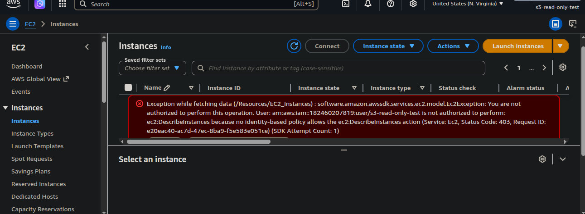

# Week 3 — IAM Deep Dive: Identity, Access & Least Privilege

**AWS Cloud Security Roadmap | Phase 1 — Foundations**

> This is Week 3 of a structured 6-month AWS Cloud Security program.
> IAM fundamentals established here were built upon in
> [Week 5 — Hardened EC2 Web Server](https://github.com/Atlas-ghostshell/Hardened-EC2-Web-Server)
> with IAM roles, STS temporary credentials, and IMDSv2 enforcement.

---

## Overview

IAM is the identity layer of AWS — every action taken in an account,
whether by a human or a service, is authorized through it. Week 3 was
a deliberate deep dive into how AWS manages identity, what makes a
permission model secure, and what breaks when it isn't.

The core principle established this week: **access should be scoped
to exactly what is required, nothing more.** That principle was
applied, tested, and verified — not just documented.

---

## Deliverable

An IAM user (`s3-read-only-test`) created under the administrator
account with a single, scoped permission: read access to a specific
S3 bucket. The user was tested via AWS CLI on Ubuntu and verified
against the AWS console.

**Test results:**
- ✅ Listed and read bucket contents via CLI
- ❌ Could not download objects from the bucket
- ❌ Could not access billing information in the console
- ❌ Could not view EC2 instances provisioned under the admin account

*s3-read-only-test user denied access to EC2 — least privilege confirmed.*

Every boundary held. Access keys were deactivated after the test
was complete.

---

## Concepts Covered

### IAM Users
A permanent identity within an AWS account with long-term credentials
(access keys and/or console password). Credentials persist until
explicitly rotated or the user is deleted. Because of their
permanence, IAM users represent a higher risk surface than roles —
a compromised key remains valid indefinitely if not rotated.

### User Groups
A collection of IAM users under the same account. Policies attached
to a group apply to every member automatically. Groups are the
correct way to manage permissions at scale — assigning policies
directly to individual users does not hold up operationally.

### IAM Roles
A temporary identity that carries no permanent credentials. Roles
are assumed by users, services, or EC2 instances to perform actions
they don't inherently have permissions for. When an EC2 instance
assumes a role, AWS STS issues short-lived credentials which are
delivered via IMDS at the instance metadata endpoint
(`169.254.169.254`). Credentials expire automatically and are
rotated without manual intervention.

**STS vs IMDS — the distinction that matters:**
- **STS** (Security Token Service) — generates the temporary credentials
- **IMDS** (Instance Metadata Service) — the endpoint on the EC2
  instance where those credentials are retrieved

They are separate components. STS generates, IMDS delivers.

### Policies
JSON documents that define what actions are allowed or denied, on
which resources, and under what conditions. Policies are attached
to users, groups, or roles. AWS evaluates all applicable policies
at request time — an explicit deny always overrides an allow.

Three policy types applied this week:
- **AWS Managed** — maintained by AWS, broad use cases
- **Customer Managed** — created and maintained per account, preferred
  for least-privilege scoping
- **Inline** — embedded directly on a single identity, not reusable

### MFA — Multi-Factor Authentication
A second authentication layer beyond username and password. Even with
valid credentials, an attacker cannot access an account without the
physical or virtual MFA device. Critical on root and administrator
accounts — the blast radius of those identities is the entire account.

### Key Rotation
The process of periodically replacing access keys to reduce the window
of exposure from a compromised key. A key that has never been rotated
is a liability that compounds over time. AWS recommends rotation every
90 days — automation via IAM Access Analyzer and AWS Config makes this
enforceable at scale.

### Least Privilege
Access is scoped to exactly what is required — nothing more. Not
"probably fine" permissions, not "might need this later" permissions.
Exact permissions for exact actions on exact resources.

This week demonstrated least privilege in practice: the `s3-read-only-test`
user could read a single bucket and nothing else. Every additional
action was denied — not by accident, but by design.

---

## What This Built Toward

| Concept | Week 3 | Week 5 |
|---------|--------|--------|
| Identity type | IAM user (permanent) | IAM role (temporary) |
| Credentials | Long-term access keys | STS-issued, auto-rotating |
| Attached to | User account | EC2 instance |
| Scope | S3 read-only | SSM access, no SSH |
| Tested via | AWS CLI + console | SSM Session Manager |

Week 3 established what least privilege looks like in practice.
Week 5 applied the same principle at the infrastructure layer —
no static credentials, no open ports, no persistent access paths.

---

## Repository
Part of the [AWS Cloud Security Roadmap](https://github.com/Atlas-ghostshell)
